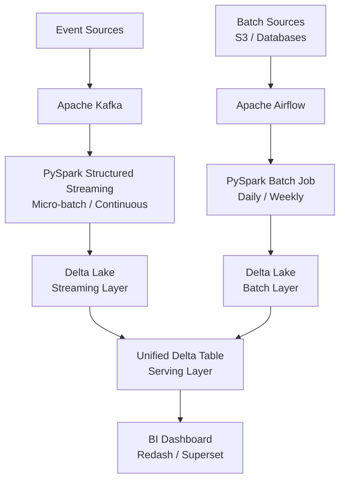

# Streaming + Batch Pipelines — Kafka + PySpark


Reference implementation of unified streaming and batch data pipelines using Kafka and PySpark. Demonstrates best practices for handling both real-time event processing and large-scale batch ETL within the same technology stack, including shared schema management and data quality checks.

## Architecture



## Features

- Side-by-side comparison of streaming vs. batch processing patterns
- Shared PySpark transformations usable in both modes
- Delta Lake for unified storage with ACID support
- Kafka Schema Registry integration for schema evolution
- Airflow orchestration for batch pipeline scheduling
- Great Expectations data quality checks at each layer
- Comprehensive unit tests for transformation logic

## Tech Stack

| Layer | Technology |
|-------|-----------|
| Streaming | Kafka + PySpark Structured Streaming |
| Batch | PySpark + Airflow DAGs |
| Storage | Delta Lake on S3 |
| Data Quality | Great Expectations |
| Testing | pytest + chispa (PySpark) |
| Infrastructure | Docker Compose |

## Prerequisites

- Docker & Docker Compose (8GB+ RAM)
- Python 3.10+
- AWS credentials for S3

## Quick Start

```bash
git clone https://github.com/zulham-tech/streaming-batch-pipelines-kafka-pyspark.git
cd streaming-batch-pipelines-kafka-pyspark
docker compose up -d
# Run streaming pipeline:
python streaming/run_streaming.py
# Run batch pipeline:
python batch/run_batch.py --date 2024-01-01
```

## Project Structure

```
.
├── streaming/           # Kafka + PySpark streaming jobs
├── batch/               # PySpark batch ETL jobs
├── shared/              # Shared transformations (reused in both)
├── quality/             # Great Expectations suites
├── tests/               # Unit + integration tests
├── dags/                # Airflow DAG definitions
├── docker-compose.yml
└── requirements.txt
```

## Author

**Ahmad Zulham Hamdan** — [LinkedIn](https://linkedin.com/in/ahmad-zulham-665170279) | [GitHub](https://github.com/zulham-tech)
